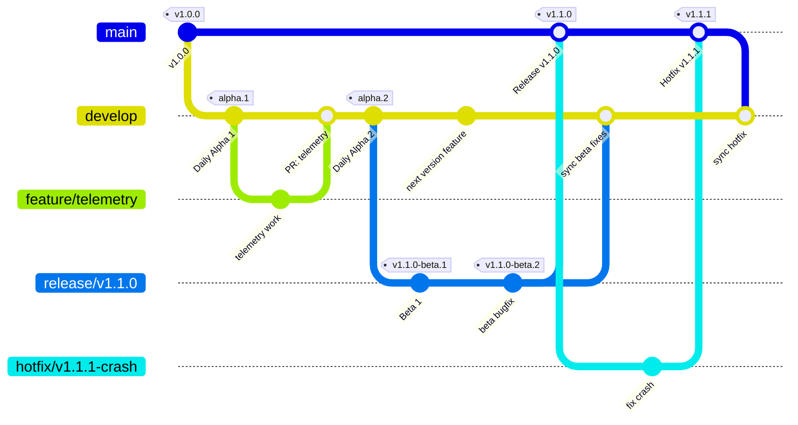

# Race Coordinator AI Development Guide

Date reviewed: 07/19/2026

This guide provides instructions for setting up your environment and running the Race Coordinator AI application on Windows and macOS from the source code.

If you encounter any problems with the steps in this document or with Race Coordinator AI itself, please report them by creating an issue on [GitHub](https://github.com/daufderheide/racecoordinator_ai/issues).

> [!NOTE]
If you follow these steps correctly, you should not need to prompt the AI to do anything for you.  If any of these steps fail, you can ask the AI to fix the issues, however we'd also appreciate a bug report on what went wrong so we can fix the problem for the next user.

> [!NOTE] 
System requirements to build and run Race Coordinator AI from source code will be higher than what is required to run the release version.  Specifically, you will need to install more software and configure your environment. It requires a somewhat modern computer with a good amount of RAM (16GB recommended) and a fast internet connection to download dependencies.  You will also need a good deal of disk space.  

---

## Windows

### Step 1: Install Google Antigravity IDE

Please install **Google Antigravity IDE** from the official product page:
- [Google Antigravity IDE Product Page](https://antigravity.google/product/antigravity-ide) *

*\* Note: Ensure you download the **IDE version** specifically, rather than any command-line tool or standalone extension.*

### Step 2: Create a GitHub Account

To collaborate and sync repository changes, you need a GitHub account. Follow these steps (if you don't already have an account):
1. Go to [GitHub](https://github.com/).
2. Click the **Sign up** button in the upper-right corner.
3. Enter your email address, create a strong password, and choose a unique username.
4. Complete the security verification puzzle.
5. Verify your email address using the code sent to your inbox.
6. Choose a plan (the free plan is sufficient for development and beta testing).
### Step 3: Install Git

Git is required to clone the repository and manage version control. Install it using one of these methods:

#### Option 1: Install via Winget (Recommended)
1. Open a Command Prompt or PowerShell terminal as **Administrator** (right-click and choose "Run as Administrator").
2. Run the following command:
   ```powershell
   winget install --id Git.Git -e --source winget
   ```
3. Follow the installation prompts and complete the setup.
4. Restart your terminal after installation.

> [!TIP]
> If winget fails with exit code 1 or other errors, try Option 2 below.

#### Option 2: Install via Official Installer
1. Download the Git installer from the official website:
   - [Git for Windows Download Page](https://git-scm.com/download/win)
2. Run the downloaded installer as Administrator (right-click and choose "Run as Administrator").
3. Follow the setup wizard with these recommended settings:
   - Use default settings for most options
   - Choose "Git from the command line and also from 3rd-party software" when asked about PATH environment
   - Select "Checkout Windows-style, commit Unix-style line endings" for line ending conversions
4. Complete the installation.
5. **Manually add Git to PATH** (required):
   - Open System Properties (Right-click "This PC" → Properties → Advanced system settings → Environment Variables)
   - Under "System variables", find "Path" and click "Edit"
   - Click "New" and add: `C:\Program Files\Git`
   - Click "OK" to save all changes
6. **Restart your IDE** (Google Antigravity IDE) for the PATH changes to take effect.

#### Troubleshooting Git Installation
- **Winget fails**: Ensure you're running the terminal as Administrator. If it still fails, use Option 2 (manual installer).
- **Git not recognized after manual installation**: The manual installer may not add Git to your PATH automatically. You need to:
  1. Add `C:\Program Files\Git` to your system PATH environment variable
  2. **Restart your IDE** (Google Antigravity IDE) for the PATH changes to take effect
- **Git not recognized after installation**: Restart your terminal or restart your computer to ensure PATH changes take effect.
- **Permission errors**: Always run installers as Administrator on Windows.

> [!WARNING]
> After manually installing Git, you **must restart your IDE** for the PATH changes to be recognized, even if you've added Git to your system PATH.

### Step 4: Install Java and Set JAVA_HOME

The server requires Java Development Kit (JDK) 8 or higher.
1. Download and install a JDK from one of these sources:
   - [Microsoft OpenJDK](https://www.microsoft.com/openjdk)
   - [Oracle JDK](https://www.oracle.com/java/technologies/downloads/)
   - [Adoptium](https://adoptium.net/)
2. **Important**: During installation, enable the "Add Java to PATH" option if available.
3. Set JAVA_HOME environment variable (if not set automatically):
   - Open System Properties → Advanced → Environment Variables
   - Under "System variables", click "New"
   - Variable name: `JAVA_HOME`
   - Variable value: Your Java installation path (e.g., `C:\Program Files\Microsoft\jdk-17.0.x` or `C:\Program Files\Java\jdk-17`)
   - Click "OK" to save
4. **Restart your IDE** for the environment variable changes to take effect.

> [!IMPORTANT]
> **Everything below** (including cloning, running dependencies, and launching the client/server) will be done directly inside the **Google Antigravity IDE**.

---

### Beta Testers

As a beta tester, you will clone the repository, install the dependencies, and run both the client and server locally on your system from the main developement branch (currently just main).

> [!WARNING]
> Because you are cloning the repository directly, you will not have permissions to push changes back to it. As such, you should not make any local changes to the code, as you will be unable to update the remote repository with them.

#### 1. Clone the Repository
Once you have your GitHub account set up, clone the repository to your local machine:
1. **Launch the Google Antigravity IDE**.
2. **Open the Terminal** within the IDE. You can find the terminal by:
   - Clicking on **Terminal** in the top menu bar and selecting **New Terminal**, or
   - Pressing the keyboard shortcut key: ``Ctrl + ` `` (control + backtick).
3. **Create and enter a directory** where you want to store your development projects. For example, run these commands to create and switch to a folder named `dev`:
   ```powershell
   mkdir dev
   cd dev
   ```
4. Run the following command in that terminal to clone the project:
   ```powershell
   git clone https://github.com/daufderheide/racecoordinator_ai.git
   ```
5. In the IDE, open the newly cloned project folder by going to **File -> Open Folder...** and selecting the `racecoordinator_ai` folder (located inside your `dev` directory).
6. Open a new terminal inside the IDE (which will now point directly to the project root directory).

#### 2. Dependencies and Installation
All required dependencies are installed automatically by the application's build and run scripts. You do not need to manually install, configure, or set up any databases, packages, or third-party dependencies on your machine.

#### 3. Building and Running the Application
To run the application, you need to start both the Java backend server and the Angular frontend client. We provide PowerShell scripts to streamline this.

> [!IMPORTANT]
> As a beta tester, there are only 2 commands you will ever need to run, and in general they should be run in this order:
> 1. `git pull` -- syncs your local codebase to the absolute latest version on GitHub.
> 2. `.\run_server.ps1` -- installs dependencies, builds, and starts both the server (port 7070) and client (port 4200)

##### Update the Codebase
Before starting the server and client, it is highly recommended to update your local codebase with the latest changes.
1. Open a terminal tab inside the Google Antigravity IDE.
2. Run the following command:
   ```powershell
   git pull
   ```

##### Run the Application
The server manages the application logic, databases, and connection ports. The client provides the web-based user interface.
1. Open a terminal tab inside the Google Antigravity IDE (by default this will be a PowerShell terminal on Windows).
2. **Ensure you're in the project directory**: The terminal should be in the `racecoordinator_ai` folder where the script is located. If you see an error like "The term '.\run_server.ps1' is not recognized", navigate to the project directory using `cd` command.
3. **Configure PowerShell execution policy** (required to run scripts):
   ```powershell
   Set-ExecutionPolicy -ExecutionPolicy RemoteSigned -Scope CurrentUser
   ```
   This allows running local scripts while maintaining security. If you see an error about execution policies, this command fixes it.
4. Run the server script:
   ```powershell
   .\run_server.ps1
   ```
   *(This script: [run_server.ps1](run_server.ps1))*
5. On first run it will automatically configure Java (if already installed), download and install Maven (if not found), install server dependencies, build the server, and start it on port 7070.
6. The client will also be started automatically. Wait for the terminal to print `Server started.`
7. Once running, access the user interface in your browser at:
   - [http://localhost:4200](http://localhost:4200)

#### Troubleshooting Common Issues

##### Java Installation Problems
- **"JAVA_HOME is not defined correctly"**: Ensure JAVA_HOME points to your Java installation directory, not the bin subdirectory. For example: `C:\Program Files\Microsoft\jdk-17.0.x` not `C:\Program Files\Microsoft\jdk-17.0.x\bin`.
- **Multiple Java versions installed**: Ensure JAVA_HOME points to your desired Java version, and that version appears first in your PATH environment variable.

##### Java Runtime Warnings (Can Be Ignored)
- **"WARNING: A restricted method in java.lang.System has been called"**: These warnings appear when using modern Java versions (17+) with certain libraries like Jansi and Guava that are used by Maven. These warnings are expected and do not prevent the server from running. They can be safely ignored.
- **"WARNING: A terminally deprecated method in sun.misc.Unsafe has been called"**: Similar to above, these are deprecation warnings from libraries used by the build process. They do not affect functionality and can be ignored.

##### PowerShell Script Execution Problems
- **"running scripts is disabled on this system"**: Run the PowerShell execution policy command: `Set-ExecutionPolicy -ExecutionPolicy RemoteSigned -Scope CurrentUser`

---

### Developers

#### 1. Branch Strategy & Release Workflow

Race Coordinator AI uses a GitFlow-style branching model designed for daily alpha builds, milestone beta testing, official production releases, and emergency production hotfixes.



##### Branch Roles

| Branch | Base Branch | Target PR Branch | Purpose |
| :--- | :--- | :--- | :--- |
| **`main`** | — | — | **Official Releases Only** (`v1.0.0`, `v1.0.1`). Protected; only receives merges from release and hotfix branches. |
| **`develop`** | `main` | — | **Active Integration & Daily Alphas**. All feature and bugfix PRs merge here. Nightly automated alpha builds run from this branch. |
| **`feature/*`** | `develop` | `develop` | New features or non-critical enhancements (e.g., `feature/custom-sounds`). |
| **`bugfix/*`** | `develop` | `develop` | Bug fixes for development (e.g., `bugfix/123-lap-counter-offset`). |
| **`release/vX.Y.Z`** | `develop` | `main` & `develop` | **Beta testing & stabilization** (e.g., `release/v1.1.0`). Prerelease beta tags (`v1.1.0-beta.1`) are cut from here. |
| **`hotfix/*`** | `main` | `main` & `develop` | Urgent production fixes (e.g., `hotfix/v1.0.1-crash`). Merged into `main` and synced down to `develop`. |

---

#### 2. Developer Workflows

##### A. Day-to-Day Feature or Bugfix Development
1. Always start from the latest `develop` branch:
   ```bash
   git checkout develop
   git pull origin develop
   git checkout -b feature/my-feature-name
   ```
2. Write code, add tests, and verify locally (see [Running Tests](#3-running-tests-locally)).
3. Commit and push your branch:
   ```bash
   git push -u origin feature/my-feature-name
   ```
4. Open a Pull Request on GitHub targeting **`develop`** (not `main`).
5. Once CI checks pass and the PR is approved, it is merged into `develop`.
6. Automated nightly CI triggers the daily alpha release (`v0.0.0-alpha.YYYYMMDD`) from `develop`.

##### B. Creating a Beta Release (Milestone Stabilization)
When planned features for a milestone (e.g., `v1.0.0`) are merged into `develop` and ready for beta testing:
1. Cut the release branch from `develop` using the target version in the branch name:
   ```bash
   git checkout develop
   git pull origin develop
   git checkout -b release/v1.0.0
   git push -u origin release/v1.0.0
   ```
2. **Automated Beta Release**: Pushing the branch automatically triggers the release CI/CD pipeline, which calculates the next beta tag (`v1.0.0-beta.1`) and publishes the beta release with all platform installer assets.
3. If bugs are found in beta, commit fixes to `release/v1.0.0` and push. Each subsequent push to `release/v1.0.0` automatically publishes `v1.0.0-beta.2`, `v1.0.0-beta.3`, etc.
4. **Sync fixes to develop**: Periodically merge `release/v1.0.0` back into `develop` so ongoing development receives all bug fixes.

##### C. Promoting Beta to Official Release (`main`)
When the beta is verified and ready for general release:
1. Ensure the root `VERSION` file has the desired release major/minor version (e.g., `1.0` or `1.0.0`):
   ```bash
   echo "1.0.0" > VERSION
   git commit -am "chore: set release version to 1.0.0"
   ```
2. Open a PR from `release/v1.0.0` into `main` (or merge directly if repository admin):
   ```bash
   git checkout main
   git pull origin main
   git merge --no-ff release/v1.0.0 -m "Release v1.0.0"
   git push origin main
   ```
3. **Automated Production Release**: Pushing to `main` automatically triggers the release CI/CD pipeline, calculates the next official tag (`v1.0.0`), and publishes the official release. Subsequent pushes to `main` with the same base version in `VERSION` will automatically increment the patch number (`v1.0.1`, `v1.0.2`, etc.).
4. Sync `main` back into `develop`:
   ```bash
   git checkout develop
   git pull origin develop
   git merge main
   git push origin develop
   ```

##### D. Emergency Production Hotfixes
If a critical issue is discovered in an official release on `main`:
1. Branch directly from `main`:
   ```bash
   git checkout main
   git pull origin main
   git checkout -b hotfix/v1.0.1-fix-crash
   ```
2. Fix and verify the issue locally.
3. Merge `hotfix/*` into `main` and push:
   ```bash
   git checkout main
   git merge --no-ff hotfix/v1.0.1-fix-crash
   git push origin main
   ```
4. **Automated Hotfix Release**: Pushing to `main` automatically detects the existing `v1.0.0` tag, calculates `v1.0.1`, and publishes the official hotfix release.
5. **Merge hotfix into develop** (and any active `release/*` branches):
   ```bash
   git checkout develop
   git pull origin develop
   git merge main
   git push origin develop
   ```

---

#### 3. Running Tests Locally

Before pushing changes or opening a PR, run the automated test suite locally.

##### Client Unit Tests (Angular / Jasmine)
```bash
cd client
npm test
```

##### Server Unit Tests (Java / JUnit)
```bash
./run_server_tests.sh
```
*(On Windows: Run in PowerShell or Git Bash)*

##### Visual & Screendiff Tests (Playwright)
```bash
npm run test:screendiff:changed
```
*(To run the full visual test suite: `cd client && npx playwright test`)*

##### Linting & Formatting
```bash
npm run lint
```

##### Test Coverage & Quality Gates
- **Server Quality Gates (JaCoCo)**: `LINE >= 80%`, `BRANCH >= 60%`.
- **Policy**: Test coverage thresholds must never be reduced to accommodate missing tests. If coverage falls below quality gates, new unit or integration tests must be written to satisfy the threshold. Any change to lower coverage thresholds requires explicit review and approval.
- **Code Length Limits**: Do not add suppressions for file length or method/function length in Java (`checkstyle:FileLength`, `checkstyle:MethodLength`) or TypeScript/JavaScript (`eslint-disable max-lines`, etc.). Instead, refactor large files and methods by decomposing them into smaller helpers, classes, or modules.

---

## macOS

macOS development setup is identical to Windows with the following tools installed via Homebrew:
1. **Java 17+**: `brew install openjdk@17`
2. **Node.js 20+**: `brew install node@20`
3. **Protobuf Compiler**: `brew install protobuf`
4. **Google Antigravity IDE**: [Antigravity IDE](https://antigravity.google/product/antigravity-ide)
5. Run the server using: `./run_server.sh`

