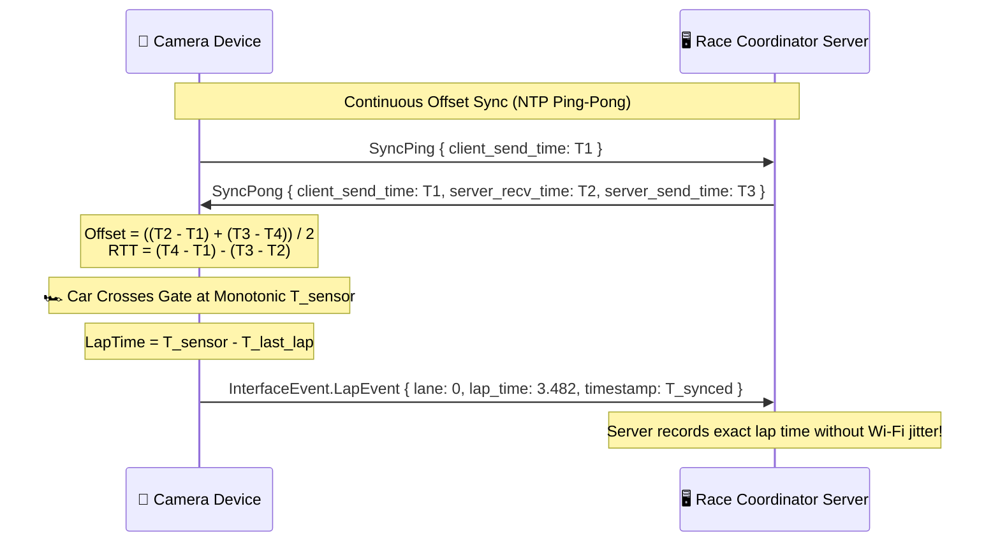
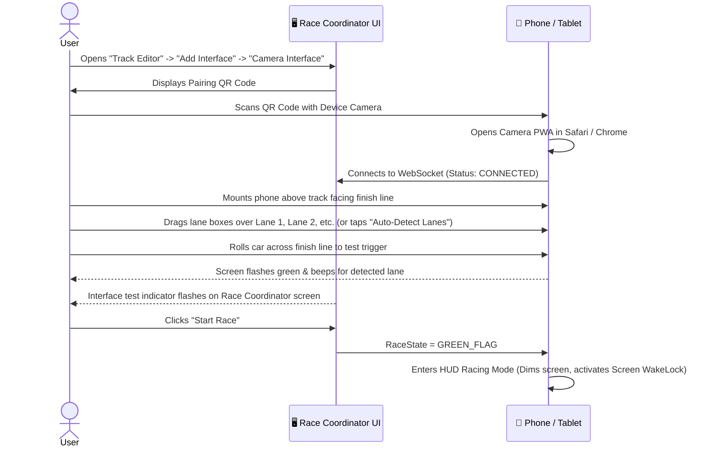

# Camera Track Interface Architecture & Integration Plan

**Date:** 08/18/2026  
**Status:** Proposed / Backlog Design Document  

---

## 1. Executive Summary

This document specifies the design and implementation plan for using a smartphone or tablet camera (iOS, iPadOS, and Android) as a wireless virtual track interface for **Race Coordinator AI**.

Optical motion detection replaces physical IR optical bridges, reed switches, and serial cables by tracking slot cars and RC vehicles across user-defined detection gates on a live video feed. Detection events are transmitted over local Wi-Fi to the Race Coordinator server via high-precision, timestamp-synchronized WebSockets using binary Protocol Buffers.

### Phased Roadmap

* **Phase 1 (Tier 1 - Core Web PWA)**: Browser-based Progressive Web App served directly by the Race Coordinator AI Javalin server. **Zero install** required; racers scan a QR code on the track screen to launch the camera in Safari (iOS) or Chrome (Android) at **60 FPS**.
* **Phase 2 (Tier 2 - High-Speed Native App)**: Standalone native companion app (Kotlin Multiplatform / Flutter) targeting **120–240 FPS** high-speed capture with manual shutter locking for sub-millisecond competition timing. Both tiers share the exact same backend WebSocket protocol and Protobuf schema.

```mermaid
flowchart TD
    subgraph MobileDevice["📱 Mobile Device (iOS / Android)"]
        Cam[Camera Feed\nTier 1: 60 FPS Web | Tier 2: 240 FPS Native] --> CV[Computer Vision Engine\nSub-ROI Motion Detection]
        CV --> Filter[Dual-Gate / Centroid Filter\n& Debounce Logic]
        Filter --> Sync[NTP-Style Time Synchronizer\nMonotonic Clock]
        Sync --> WSClient[WebSocket Client\nBinary Protobuf]
    end

    subgraph RCServer["🖥️ Race Coordinator AI Server"]
        WSServer["/api/interface-data\nWebSocket Endpoint"] --> Proto["CameraWebSocketProtocol\n(extends DefaultProtocol)"]
        Proto --> Manager["ClientSubscriptionManager\n& HeatExecutionManager"]
        Manager --> Race["Active Race Engine\n(Laps, Splits, Pit Stops)"]
    end

    subgraph RCUI["💻 Race Coordinator Web UI"]
        Setup["Track Editor / Raceday Setup\n(QR Code Pairing)"]
        Overlay["Live Race Leaderboard"]
    end

    WSClient <== "Wi-Fi WebSocket (Protobuf InterfaceEvent)" ==> WSServer
    Setup -. "Scan QR to Pair" .-> MobileDevice
    Race ==> Overlay
```

---

## 2. Tier Comparison & Timing Accuracy

| Metric | **Tier 1: Web PWA (Phase 1)** | **Tier 2: Native App (Phase 2)** | **Physical Hardware (Arduino / IR)** |
| :--- | :--- | :--- | :--- |
| **Delivery Mechanism** | Served by RC AI Javalin Server (HTML5/Canvas/Wasm) | Standalone Native App (KMP / Flutter) | USB Serial / GPIO Hardware |
| **Target Platforms** | 100% cross-platform (iOS Safari, Android Chrome) | iOS 15+ (AVFoundation), Android 8+ (Camera2/X) | Windows, macOS, Linux |
| **Installation** | **Zero install** (Scan QR code) | App Store / Play Store / APK | Drivers & USB cables |
| **Frame Rate** | **60 FPS** ($16.67\text{ ms}$ interval) | **120–240 FPS** ($4.17\text{ ms}$ interval) | Continuous polling ($< 0.1\text{ ms}$) |
| **Raw Quantization Jitter** | $\pm 8.33\text{ ms}$ | $\pm 2.08\text{ ms}$ | $< 0.1\text{ ms}$ |
| **Interpolated Accuracy** | **$\pm 3.0\text{ to } 5.0\text{ ms}$** | **$\pm 0.5\text{ to } 1.0\text{ ms}$** | $\approx \pm 0.5\text{ ms}$ |
| **Car Travel / Frame @ $20\text{ ft/s}$** | $100\text{ mm}$ ($3.9\text{ in}$) | $25\text{ mm}$ ($1.0\text{ in}$) | Continuous optical trigger |
| **Motion Blur Control** | Automatic exposure ($1/60\text{s} - 1/120\text{s}$) | Locked high-speed shutter ($1/1000\text{s}+$) | N/A (optical beam break) |
| **Recommended Use** | **Club racing, practice, pit-stops, split sectors** | **Qualifying records, photo-finishes** | Sanctioned championship baseline |

### Physical Crossing Dynamics

At a typical slot car finish line speed of **$20\text{ ft/s}$ ($6.1\text{ m/s}$)**:
* A 1/32 scale car ($\approx 130\text{ mm}$) moves **$6.1\text{ mm}$ per millisecond**.
* **At 60 FPS ($16.67\text{ ms}$)**: The vehicle moves $101.7\text{ mm}$ between frames (spanning 1–2 video frames during crossing).
* **At 240 FPS ($4.17\text{ ms}$)**: The vehicle moves only $25.4\text{ mm}$ between frames (spanning 5–8 distinct frames during crossing), enabling fine-grained polynomial trajectory fitting.

---

## 3. Computer Vision & Motion Detection Pipeline

To guarantee battery efficiency and prevent thermal throttling on mobile devices, the vision pipeline processes only cropped Regions of Interest (ROIs) rather than full 1080p frames.

```mermaid
flowchart LR
    Frame[Video Frame] --> Crop[Crop to Lane ROIs\n~40x15 px per lane]
    Crop --> Diff[Temporal Differencing\n|Frame(t) - Background|]
    Diff --> Thresh[Adaptive Thresholding\n& Blob Density]
    Thresh --> Gate{Crossing Centroid\n& Direction Valid?}
    Gate -- Yes --> Debounce{Debounce &\nMin Lap Check}
    Gate -- No --> Ignore[Ignore Noise / Flicker]
    Debounce -- Pass --> Trigger[Generate Lap / Sector Event]
    Debounce -- Fail --> Ignore
```

### A. Dynamic Background Model
A slowly updating background model adapts to changing ambient room light while ignoring fast-moving cars:
$$B(x, y, t) = (1 - \alpha) B(x, y, t-1) + \alpha I(x, y, t) \quad (\alpha \approx 0.02)$$

### B. Sub-Frame Centroid & Edge Interpolation
When the vehicle blob enters the lane ROI gate in frame $N$, the exact fractional frame crossing time is computed:
$$t_{\text{crossing}} = t_{N-1} + \Delta t \cdot \left( \frac{\text{Threshold} - \text{Intensity}_{N-1}}{\text{Intensity}_N - \text{Intensity}_{N-1}} \right)$$

### C. Directional Dual-Gate Validation
Each lane gate is subdivided into Gate $A$ (entry) and Gate $B$ (exit). A trigger is only valid if Gate $A$ fires before Gate $B$. This prevents false triggers from:
* Marshals reaching across the track to retrieve a deslot car.
* Transient shadows cast by people walking around the track.
* Vehicle headlights or reflective glares moving in reverse.

---

## 4. High-Precision Time Synchronization

To eliminate Wi-Fi latency jitter ($2 - 50\text{ ms}$), the client device and Race Coordinator server perform continuous clock offset calibration.



---

## 5. Proposed Database & Protobuf Schema

### A. `track_model.proto` Extension
```protobuf
syntax = "proto3";
package com.antigravity;

message CameraInterfaceConfig {
  string name = 1;
  int32 interface_index = 2;
  int32 target_fps = 3;             // 60, 120, 240
  bool auto_detect_lanes = 4;
  repeated LaneDetectionGate gates = 5;
}

message LaneDetectionGate {
  int32 lane_index = 1;
  float x_pct = 2;                 // Normalized coordinates (0.0 - 1.0)
  float y_pct = 3;
  float width_pct = 4;
  float height_pct = 5;
  int32 gate_type = 6;             // 0 = LAP/FINISH, 1 = SECTOR, 2 = PIT_IN, 3 = PIT_OUT
  float sensitivity = 7;
}

message TrackModel {
  ...
  repeated CameraInterfaceConfig camera_configs = 12;
}
```

### B. `interface_event.proto` Extension
```protobuf
message InterfaceEvent {
  oneof event {
    LapEvent lap = 1;
    SegmentEvent segment = 2;
    InterfaceStatusEvent status = 3;
    CallbuttonEvent callbutton = 4;
    InterfaceAnalogDataEvent analogData = 5;
    InterfaceDigitalPinEvent digitalPin = 6;
    PitInEvent pit_in = 7;
    PitOutEvent pit_out = 8;
    CameraHeartbeatEvent camera_heartbeat = 9;
  }
}

message PitInEvent {
  int32 lane = 1;
  int32 interface_index = 2;
}

message PitOutEvent {
  int32 lane = 1;
  int32 interface_index = 2;
}

message CameraHeartbeatEvent {
  int32 interface_index = 1;
  int32 current_fps = 2;
  float battery_level = 3;
  double client_timestamp = 4;
}
```

---

## 6. User Experience & Setup Workflow



### Interactive Features on Mobile Screen:
1. **Visual Gate Alignment Overlay**: Drag-and-drop semi-transparent colored boxes corresponding to lane colors.
2. **Auto-Snap Lane Detection**: Rolling a car down each lane traces the motion path and automatically snaps gate boundaries to the slot rails.
3. **Live Trigger Oscilloscope**: Real-time signal spike graph showing ambient noise floor vs car detection threshold.
4. **Screen WakeLock**: Uses `navigator.wakeLock.request('screen')` to prevent the device from dimming or sleeping during long endurance races.
5. **Two-Way HUD Feedback**: Phone screen reflects race flags (Green for racing, Yellow for call-button track pause, Checkered for heat over).

---

## 7. Physical Mounting & Lighting Best Practices

1. **Mounting Position**: 
   * **Overhead (90°)**: Best for multi-lane tracks with minimal perspective distortion.
   * **Angled (45°)**: Good for tablet stands or desktop tripods positioned trackside.
   * **Distance**: 12–24 inches (30–60 cm) above track level covering the full track width.
2. **Lighting**:
   * Continuous diffused DC LED lighting is recommended.
   * Avoid unshielded 50/60 Hz AC fluorescent tubes that can create frame-to-frame luminance pulsing.
3. **Contrast**:
   * High contrast between car body / roof and track surface delivers the cleanest centroid detection.

---

## 8. Implementation Roadmap

### Phase 1: Tier 1 (Universal Web PWA)
1. **Server Protocol Integration**:
   * Create `CameraWebSocketProtocol.java` extending `DefaultProtocol`.
   * Register `CameraInterfaceConfig` in `HardwareProtocolFactory.java` and `TrackModel`.
   * Add incoming binary `InterfaceEvent` decoding to `/api/interface-data` in `App.java` and `ClientSubscriptionManager.java`.
2. **Frontend Camera PWA**:
   * Build Angular `/camera-interface` route optimized for mobile viewports.
   * Implement HTML5 `getUserMedia` (60 FPS) and Web Worker Canvas motion differencing pipeline.
   * Add interactive SVG gate placement overlay with touch gesture support.
   * Add QR code generator dialog in Track Editor.

### Phase 2: Tier 2 (High-Speed Native App)
1. **Native High-Speed Engine (Flutter / Kotlin Multiplatform)**:
   * Implement Android `Camera2`/`CameraX` 120/240 FPS stream with locked exposure.
   * Implement iOS `AVFoundation` 120/240 FPS stream with manual shutter control.
   * Package C++ OpenCV / Accelerate SIMD motion differencing kernel.
2. **mDNS / Zero-Conf Discovery**:
   * Add JmDNS (`_racecoordinator._tcp.local.`) on port 7070 for automatic app discovery without typing IP addresses.
